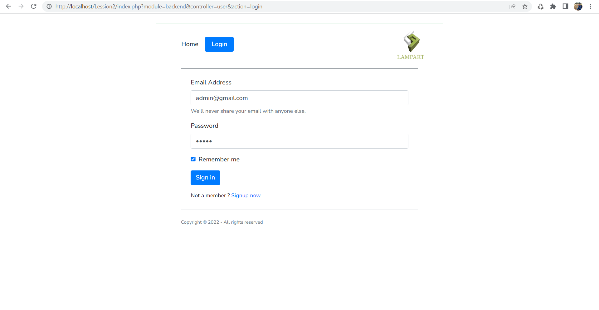
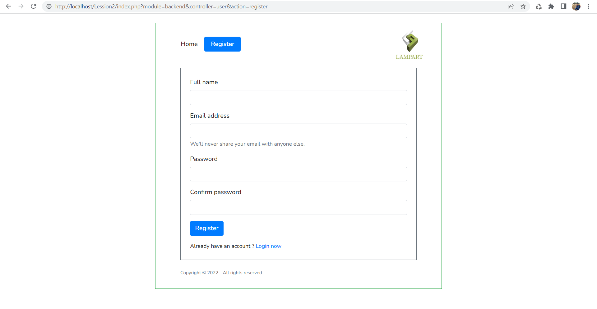
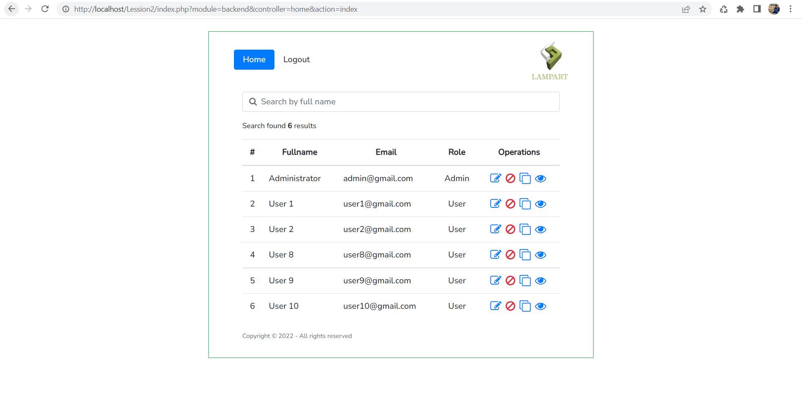
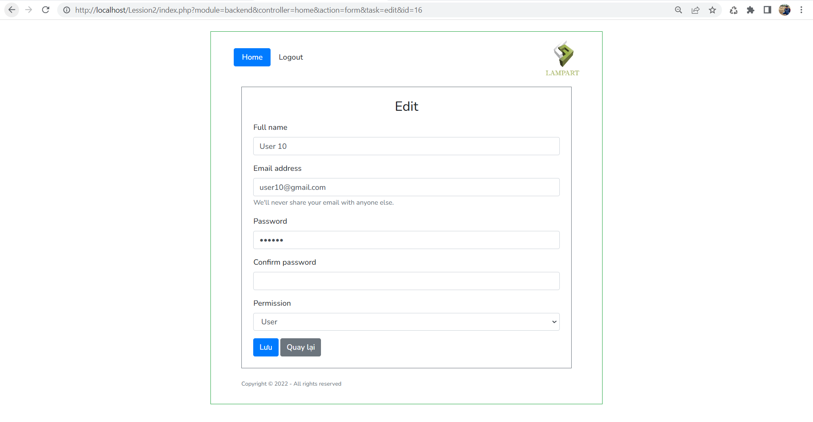
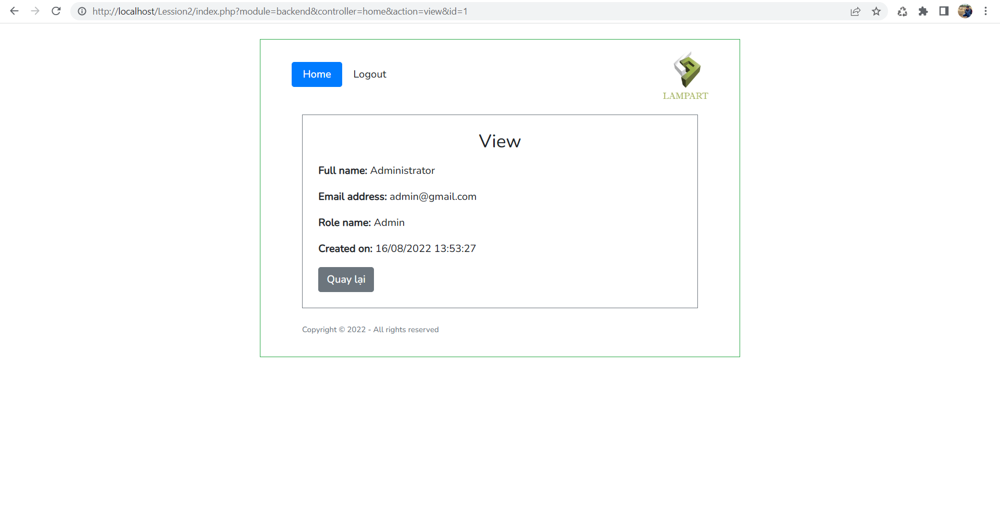

<h2>CONFIGURATION</h2>
<ol>
    <li>Clone project in branch <b>"test"</b> to xampp/htdocs by command: git clone -b test https://github.com/WannK-IT/Lession2.git</li>
    <li>Create database name is <b>"manage_user"</b> in your local phpmyadmin. Then import file <b>"manager_user.sql"</b> in folder <b>"database"</b> of project.</li>
    <li>In file <b>"define.php"</b> (can skip this line if set project by default)
        <ul>
            <li>Set user & password of phpmyadmin (default: user = root, no password).</li>
            <li>If can't set path by default, re-set path of project by constant <b>ROOT_URL</b>.</li>
        </ul>
    </li>
    <li>Run project. Recommend run on Chrome browser.</li>
    <li>For example my local URL: http://localhost/Lession2/index.php</li>
    <li><b>ACCOUNT LOGIN ADMIN:</b> 
        <ul>
            <li><b>email:</b> admin@gmail.com</li>
            <li><b>password</b>: admin</li>
        </ul>
    </li>
</ol>

<h2>Images Demo</h2>
<ol>
    <li>
        
Login page

        
    </li>
    <li>
        
Register page

        
    </li>
    <li>
        
Home page

        
    </li>
    <li>
        
Edit page

        
    </li>
    <li>
        
View page

        
    </li>
</ol>

