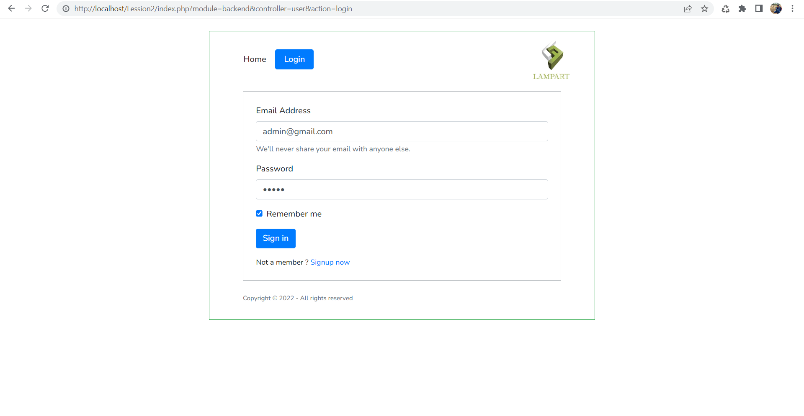
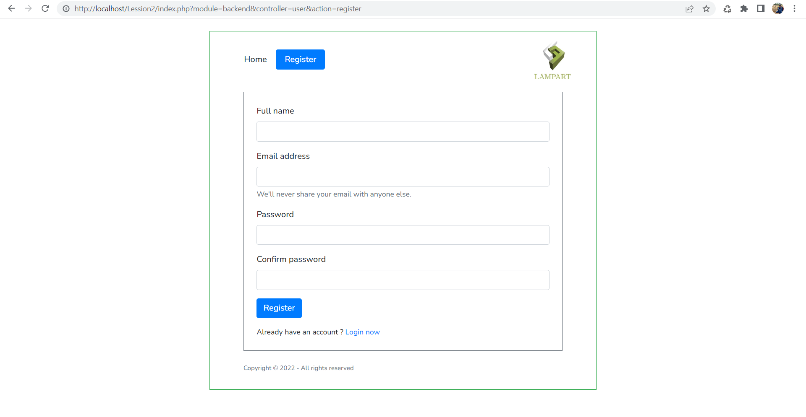
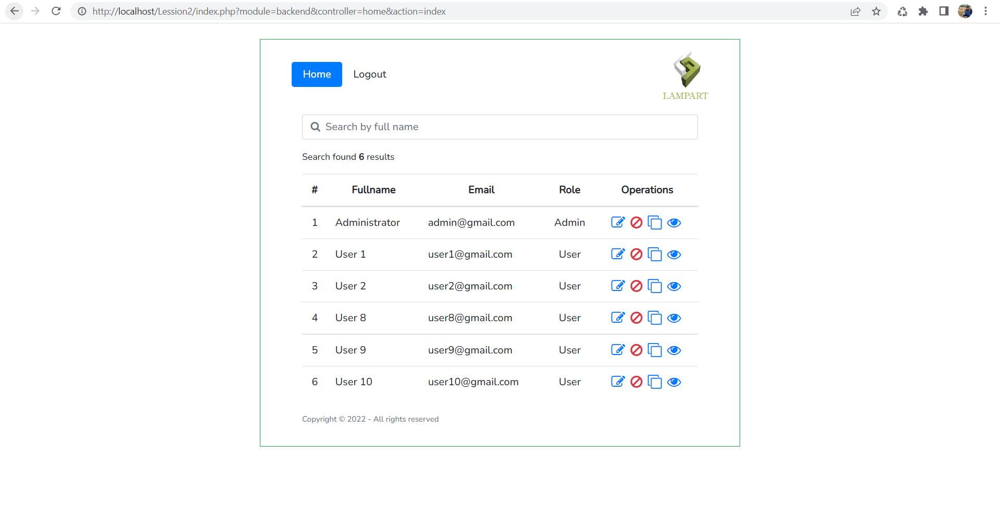
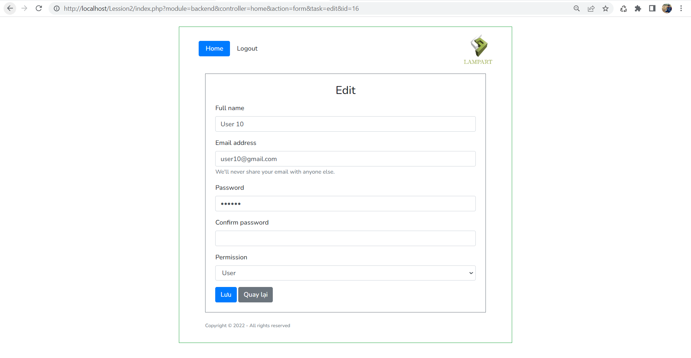
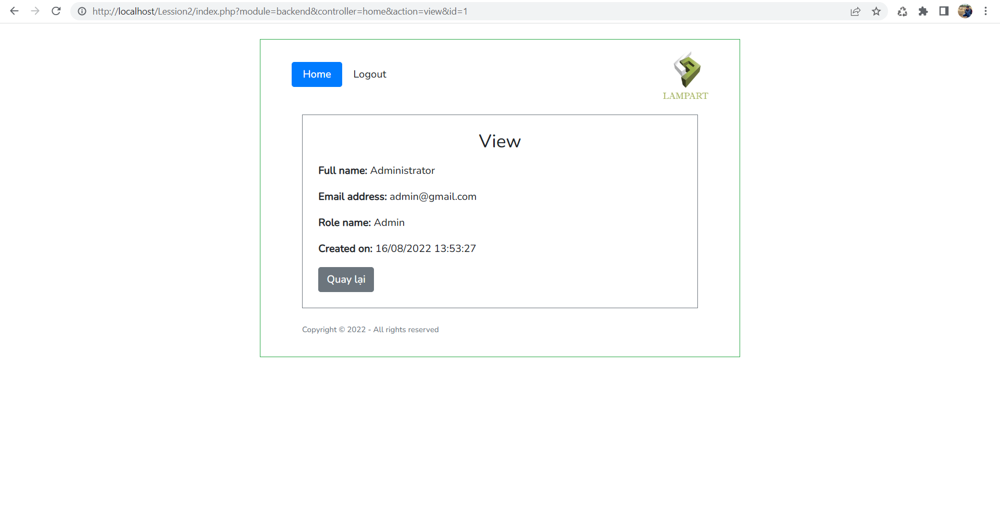

<h2>CONFIGURATION</h2>
<ol>
    <li>Clone project in "test" branch by command: git clone -b test https://github.com/WannK-IT/Lession2.git.</li>
    <li>Create database name is "manage_user" in your local.</li>
    <li>Import file "manager_user.sql" in folder "database" of project.</li>
    <li>Run project</li>
    <li>For example my local URL: http://localhost/Lession2/index.php</li>
</ol>

<h2>Images Demo</h2>
<ol>
    <li>
Login page
</li>
    <li>
Register page
</li>
    <li>
Home page
</li>
    <li>
Edit page
</li>
    <li>
View page
</li>
</ol>
